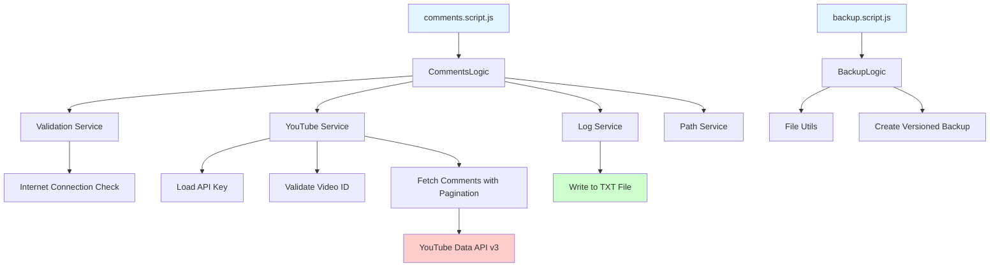

# YouTube Comments

A Node.js application to fetch and log all comments from a specific YouTube video using the YouTube Data API v3.

Built in April 2021. This application provides a simple way to extract all comments from any public YouTube video and save them to a TXT file for analysis, archival, or research purposes.

## Features

- 📥 Fetches all comments from any YouTube video
- 🔄 Handles pagination automatically for videos with thousands of comments
- ⏱️ Rate limiting support to respect API quotas
- 📊 Real-time progress tracking
- 💾 Exports comments to TXT file
- ✅ Validates video existence and API key
- 🔒 Secure API key management (external file)
- 🗃️ Built-in backup utility for project archival
- 🌐 Internet connection validation
- 📈 Supports up to 100,000 comments per session

## Getting Started

### Prerequisites

- Node.js (v14 or higher)
- npm or pnpm
- YouTube Data API v3 key (get it from [Google Cloud Console](https://console.cloud.google.com/))

### Installation

1. Clone the repository:
```bash
git clone https://github.com/orassayag/youtube-comments.git
cd youtube-comments
```

2. Install dependencies:
```bash
npm install
```

### Configuration

1. **Create API Key File**

Create a JSON file with your YouTube API key. Example format (see `misc/examples/apiKey.json`):
```json
{
  "api_key": "YOUR_YOUTUBE_API_KEY_HERE"
}
```

2. **Configure Settings**

Edit `src/settings/settings.js`:
- `VIDEO_ID`: The YouTube video ID (from the URL, e.g., 'dQw4w9WgXcQ')
- `API_KEY_PATH`: Path to your API key JSON file
- `DIST_FILE_NAME`: Output filename (default: 'comments')
- `MAXIMUM_COMMENTS_COUNT`: Max comments to fetch (default: 100,000)
- `MILLISECONDS_FETCH_DELAY_COUNT`: Delay between API calls (default: 1000ms)
- `MAXIMUM_FETCH_COMMENTS_COUNT`: Comments per API request (max: 100)

## Available Scripts

### Fetch Comments
Fetches all comments from the configured YouTube video:
```bash
npm start
```

### Create Backup
Creates a timestamped backup of the project:
```bash
npm run backup your-backup-title
```

### Sandbox Test
Runs sandbox test file:
```bash
npm run sand
```

### Stop Execution
Forcefully stops all Node.js processes (Windows only):
```bash
npm run stop
```

## Project Structure

```
youtube-comments/
├── src/
│   ├── core/
│   │   ├── enums/           # Enumerations (status, placeholders, etc.)
│   │   └── models/          # Data models
│   ├── logics/              # Business logic
│   ├── scripts/             # Entry point scripts
│   ├── services/            # Service layer
│   ├── settings/            # Configuration
│   ├── tests/               # Test files
│   └── utils/               # Utility functions
├── dist/                    # Output directory for comments
├── backups/                 # Project backups
├── misc/                    # Miscellaneous files
│   └── examples/            # Example files
└── package.json
```

## Architecture



## How It Works

1. **Initialization**: Validates settings and internet connection
2. **API Key Loading**: Reads YouTube API key from external JSON file
3. **Video Validation**: Checks if the video exists and is accessible
4. **Comment Count**: Retrieves expected total comment count
5. **Pagination Loop**: Fetches comments in batches (max 100 per request)
6. **Progress Tracking**: Displays real-time progress in console
7. **File Writing**: Saves comments to TXT file in `dist/` directory
8. **Rate Limiting**: Applies configurable delays between API calls

## API Rate Limits

YouTube Data API v3 has a daily quota of **200,000 read operations**:
- Each video details request: 1 unit
- Each comment threads request: 1 unit

To stay within limits:
- Adjust `MILLISECONDS_FETCH_DELAY_COUNT` to add delays
- Use `MAXIMUM_COMMENTS_COUNT` to limit total comments
- Monitor quota in Google Cloud Console

## Error Codes

All errors include unique codes (1000001-1000027) for easy troubleshooting:
- **1000001-1000002**: Backup errors
- **1000013-1000027**: YouTube API and comment fetching errors

See error messages for specific codes and descriptions.

## Example Output

Successful execution will look like:
```
===IMPORTANT SETTINGS===
VIDEO_ID: dQw4w9WgXcQ
API_BASE_URL: https://www.googleapis.com/youtube/v3/
DIST_FILE_NAME: comments
MAXIMUM_COMMENTS_COUNT: 100000
MILLISECONDS_FETCH_DELAY_COUNT: 1000
MAXIMUM_FETCH_COMMENTS_COUNT: 100
========================
OK to run? (y = yes)
y
===VALIDATE GENERAL SETTINGS===
===INITIATE THE SERVICES===
===FETCH COMMENTS===
===Writing comments: 5,432/8,123 | 66.87%===
===EXIT: FINISH===
```

The output file (`dist/comments.txt`) will contain all comments, one per line.

## Built With

* [Node.js](https://nodejs.org/) - JavaScript runtime
* [axios](https://axios-http.com/) - HTTP client for API requests
* [fs-extra](https://github.com/jprichardson/node-fs-extra) - Enhanced file system operations
* [is-reachable](https://github.com/sindresorhus/is-reachable) - Internet connection validation
* [YouTube Data API v3](https://developers.google.com/youtube/v3) - Comment data source

## Development

The project uses:
- **ES Modules** (type: "module")
- **ESLint** for code quality
- Modular architecture with services, utilities, and models

## Contributing

Contributions to this project are [released](https://help.github.com/articles/github-terms-of-service/#6-contributions-under-repository-license) to the public under the [project's open source license](LICENSE).

Everyone is welcome to contribute. Contributing doesn't just mean submitting pull requests—there are many different ways to get involved, including answering questions and reporting issues.

Please feel free to contact me with any question, comment, pull-request, issue, or any other thing you have in mind.

## Author

* **Or Assayag** - *Initial work* - [orassayag](https://github.com/orassayag)
* Or Assayag <orassayag@gmail.com>
* GitHub: https://github.com/orassayag
* StackOverflow: https://stackoverflow.com/users/4442606/or-assayag?tab=profile
* LinkedIn: https://linkedin.com/in/orassayag

## License

This application has an MIT license - see the [LICENSE](LICENSE) file for details.
