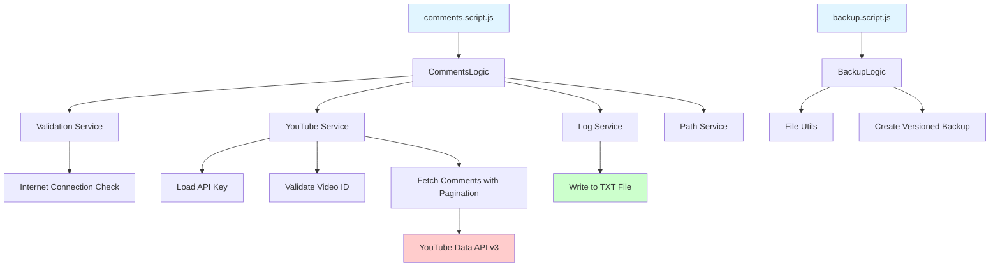

# Youtube Comments

A Node.js application to fetch and log all comments from a specific YouTube video using the YouTube Data API v3.

Built in April 2021. This application provides a simple way to extract all comments from any public YouTube video and save them to a TXT file for analysis, archival, or research purposes with pagination support and rate limiting v3.

## Features

### Core Capabilities

- **YouTube API Integration**: Efficiently fetches comments using the YouTube Data API v3.
- **Automated Pagination**: Seamlessly handles multiple pages of comments for high-volume videos.
- **Real-time Progress Tracking**: Live console updates on fetch percentage and comment counts.
- **Secure Key Management**: API keys are stored in a separate, ignored JSON file for security.
- **Project Backup System**: Automated timestamped backups for development safety.

### Technical Excellence

- **Service-Oriented Architecture**: Modular design separating API logic, file I/O, and validation.
- **Centralized Error Handling**: Systematic error reporting with unique numeric codes.
- **Validation Layers**: Multi-step checks for internet connectivity, settings, and API keys.
- **Data Modeling**: Strict data structures for application state and YouTube responses.
- **Performance Optimized**: Configurable delays and batch sizes to respect API quotas.

### Developer Experience

- **Clean Configuration**: Centralized `settings.js` for all operational parameters.
- **Sandbox Environment**: Dedicated test file for rapid prototyping and validation.
- **Comprehensive Logging**: Detailed console output and persistent file logging.
- **Modular Design**: Easy to extend or swap individual services or utilities.
- **Task Management**: Quick scripts for starting, backing up, and force-stopping the app.

## Getting Started

### Prerequisites

- Node.js (v14 or higher)
- npm or pnpm
- YouTube Data API v3 key (get it from [Google Cloud Console](https://console.cloud.google.com/))

### Installation

1. Clone the repository:

```bash
git clone https://github.com/orassayag/youtube-comments.git
cd youtube-comments
```

2. Install dependencies:

```bash
npm install
```

### Configuration

1. **Create API Key File**

Create a JSON file with your YouTube API key. Example format (see `misc/examples/apiKey.json`):

```json
{
  "api_key": "YOUR_YOUTUBE_API_KEY_HERE"
}
```

2. **Configure Settings**

Edit `src/settings/settings.js`:

- `VIDEO_ID`: The YouTube video ID (from the URL, e.g., 'dQw4w9WgXcQ')
- `API_KEY_PATH`: Path to your API key JSON file
- `DIST_FILE_NAME`: Output filename (default: 'comments')
- `MAXIMUM_COMMENTS_COUNT`: Max comments to fetch (default: 100,000)
- `MILLISECONDS_FETCH_DELAY_COUNT`: Delay between API calls (default: 1000ms)
- `MAXIMUM_FETCH_COMMENTS_COUNT`: Comments per API request (max: 100)

## Available Scripts

### Fetch Comments

Fetches all comments from the configured YouTube video:

```bash
npm start
```

### Create Backup

Creates a timestamped backup of the project:

```bash
npm run backup your-backup-title
```

### Sandbox Test

Runs sandbox test file:

```bash
npm run sand
```

### Stop Execution

Forcefully stops all Node.js processes (Windows only):

```bash
npm run stop
```

## Usage

### Fetching Comments

Run `npm start` to begin the extraction process. The application will validate your configuration and internet connection before starting the fetch.

### Creating Backups

Use `npm run backup <title>` to create a timestamped snapshot of the codebase. Backups are stored in the `backups/` directory.

### Testing Logic

Execute `npm run sand` to run the sandbox environment. This is useful for testing utility functions or service logic in isolation.

### Force Stop

Run `npm run stop` to kill all active node processes on Windows. Useful if a script hangs or needs immediate termination.

## Best Practices

- **Quota Awareness**: Monitor YouTube API usage and adjust fetch delays in `settings.js` to avoid hitting daily limits.
- **Security First**: Never commit your `apiKey.json` file to version control. Use the provided example as a template.
- **Data Integrity**: Regularly verify the `dist/` output against the configured video to ensure all comments were captured.
- **Code Maintenance**: Always create a backup using the backup utility before performing major refactors or updates.

## Architecture Principles

- **Decoupled Components**: Services, utilities, and models are independent, making the system easier to test and maintain.
- **Consistency**: The application uses unified response formats and error structures across all modules for predictability.
- **Simplicity**: Minimal external dependencies are used to keep the project lightweight and reduce the security surface area.
- **Fail-Fast**: Multi-layer validation ensures that configuration or network issues are caught before making API calls.

## Directory Structure

- `src/core/`: Application constants, enums, and formal data models.
- `src/services/`: Core business services including API interaction, path resolution, and validation.
- `src/utils/`: Domain-specific helper functions for file I/O, logging, and system operations.
- `src/scripts/`: Command-line entry points for the application's primary functions.
- `src/settings/`: Centralized application configuration and operational settings.

## Design Patterns

- **Service Pattern**: Business logic is encapsulated in specialized service classes, promoting reuse and testability.
- **Data Model Pattern**: Formal objects are used for data transfer and state management to ensure type consistency.
- **Utility Pattern**: Stateless helper functions are grouped by functional area for easy access and organization.
- **Script Entry Pattern**: Dedicated entry points for different CLI operations provide a clear interface for users.

## Project Structure

```
youtube-comments/
├── src/
│   ├── core/
│   │   ├── enums/           # Enumerations (status, placeholders, etc.)
│   │   └── models/          # Data models
│   ├── logics/              # Business logic
│   ├── scripts/             # Entry point scripts
│   ├── services/            # Service layer
│   ├── settings/            # Configuration
│   ├── tests/               # Test files
│   └── utils/               # Utility functions
├── dist/                    # Output directory for comments
├── backups/                 # Project backups
├── misc/                    # Miscellaneous files
│   └── examples/            # Example files
└── package.json
```

## Architecture


```mermaid
graph TD
    A[comments.script.js] --> B[CommentsLogic]
    B --> C[Validation Service]
    B --> D[YouTube Service]
    B --> E[Log Service]
    B --> F[Path Service]

    C --> G[Internet Connection Check]

    D --> H[Load API Key]
    D --> I[Validate Video ID]
    D --> J[Fetch Comments with Pagination]

    J --> K[YouTube Data API v3]

    E --> L[Write to TXT File]

    M[backup.script.js] --> N[BackupLogic]
    N --> O[File Utils]
    N --> P[Create Versioned Backup]

    style A fill:#e1f5ff
    style M fill:#e1f5ff
    style K fill:#ffcccc
    style L fill:#ccffcc
```

## How It Works

1. **Initialization**: Validates settings and internet connection
2. **API Key Loading**: Reads YouTube API key from external JSON file
3. **Video Validation**: Checks if the video exists and is accessible
4. **Comment Count**: Retrieves expected total comment count
5. **Pagination Loop**: Fetches comments in batches (max 100 per request)
6. **Progress Tracking**: Displays real-time progress in console
7. **File Writing**: Saves comments to TXT file in `dist/` directory
8. **Rate Limiting**: Applies configurable delays between API calls

## API Rate Limits

YouTube Data API v3 has a daily quota of **200,000 read operations**:

- Each video details request: 1 unit
- Each comment threads request: 1 unit

To stay within limits:

- Adjust `MILLISECONDS_FETCH_DELAY_COUNT` to add delays
- Use `MAXIMUM_COMMENTS_COUNT` to limit total comments
- Monitor quota in Google Cloud Console

## Error Codes

All errors include unique codes (1000001-1000027) for easy troubleshooting:

- **1000001-1000002**: Backup errors
- **1000013-1000027**: YouTube API and comment fetching errors

See error messages for specific codes and descriptions.

## Example Output

Successful execution will look like:

```
===IMPORTANT SETTINGS===
VIDEO_ID: dQw4w9WgXcQ
API_BASE_URL: https://www.googleapis.com/youtube/v3/
DIST_FILE_NAME: comments
MAXIMUM_COMMENTS_COUNT: 100000
MILLISECONDS_FETCH_DELAY_COUNT: 1000
MAXIMUM_FETCH_COMMENTS_COUNT: 100
========================
OK to run? (y = yes)
y
===VALIDATE GENERAL SETTINGS===
===INITIATE THE SERVICES===
===FETCH COMMENTS===
===Writing comments: 5,432/8,123 | 66.87%===
===EXIT: FINISH===
```

The output file (`dist/comments.txt`) will contain all comments, one per line.

## Built With

- [Node.js](https://nodejs.org/) - JavaScript runtime
- [axios](https://axios-http.com/) - HTTP client for API requests
- [fs-extra](https://github.com/jprichardson/node-fs-extra) - Enhanced file system operations
- [is-reachable](https://github.com/sindresorhus/is-reachable) - Internet connection validation
- [YouTube Data API v3](https://developers.google.com/youtube/v3) - Comment data source

## Development

The project uses:

- **ES Modules** (type: "module")
- **ESLint** for code quality
- Modular architecture with services, utilities, and models

## Contributing

Contributions to this project are [released](https://help.github.com/articles/github-terms-of-service/#6-contributions-under-repository-license) to the public under the [project's open source license](LICENSE).

Everyone is welcome to contribute. Contributing doesn't just mean submitting pull requests—there are many different ways to get involved, including answering questions and reporting issues.

Please feel free to contact me with any question, comment, pull-request, issue, or any other thing you have in mind.

## Support

For questions, issues, or contributions:

- **GitHub Issues**: [https://github.com/orassayag/youtube-comments/issues](https://github.com/orassayag/youtube-comments/issues)
- **Email**: orassayag@gmail.com

## Author

- **Or Assayag** - _Initial work_ - [orassayag](https://github.com/orassayag)
- Or Assayag <orassayag@gmail.com>
- GitHub: https://github.com/orassayag
- StackOverflow: https://stackoverflow.com/users/4442606/or-assayag?tab=profile
- LinkedIn: https://linkedin.com/in/orassayag

## License

This application has an MIT license - see the [LICENSE](LICENSE) file for details.

## Acknowledgments

- Built for educational and research purposes
- Respects robots.txt and implements rate limiting
- Uses user-agent rotation to avoid detection
- Implements polite crawling practices
